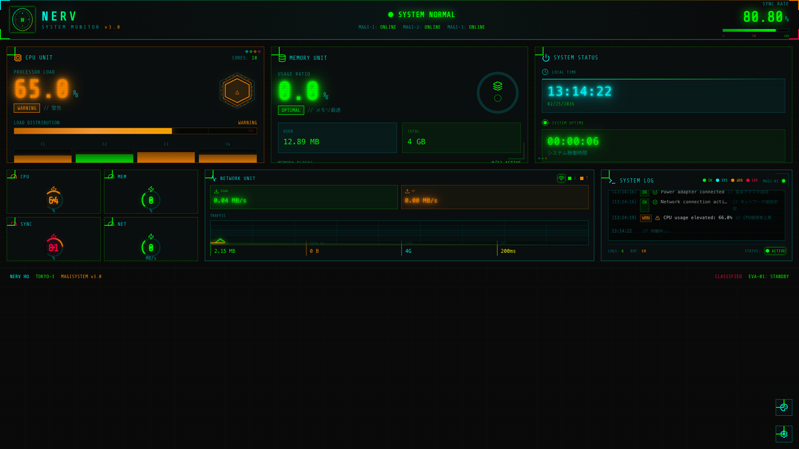
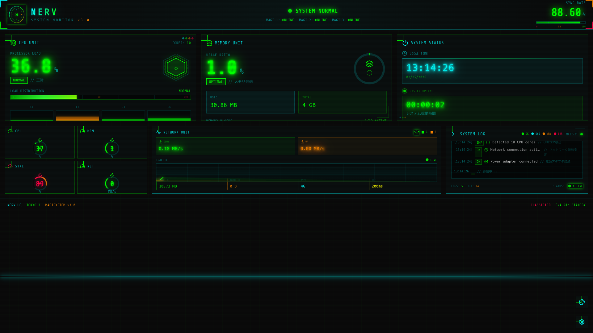
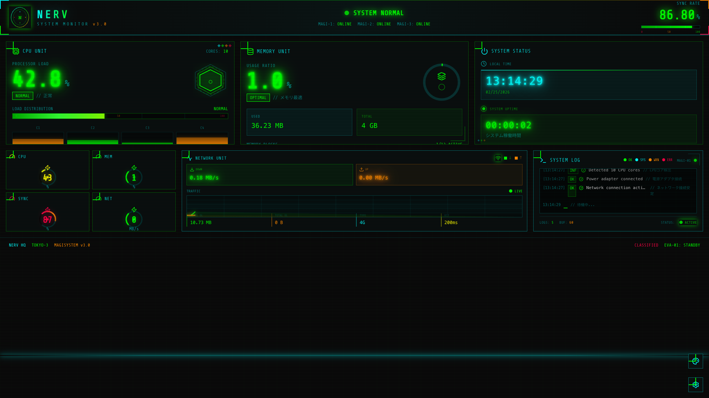
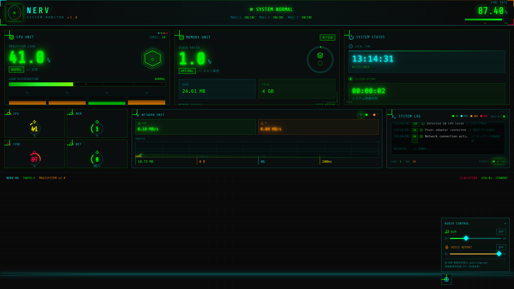

# 🔺 NERV System Monitor

<p align="center">
  
  
  
  
</p>

<p align="center">
  <b>新世纪福音战士 (EVA) 风格的实时系统监控面板</b>
</p>

<p align="center">
  <a href="#demo">🚀 在线演示</a> •
  <a href="#features">✨ 特性</a> •
  <a href="#screenshots">📸 截图</a> •
  <a href="#installation">📦 安装</a> •
  <a href="#themes">🎨 主题</a>
</p>

---

## 🎬 Demo

**在线演示**: [https://michaelnelsonpro.github.io/personalTest/](https://michaelnelsonpro.github.io/personalTest/)

> ⚠️ 音频功能需要用户交互后才能启用（浏览器自动播放策略）

---

## ✨ Features

### 🖥️ 实时监控
- **CPU 使用率** - 基于 `requestIdleCallback` 的真实 CPU 估算
- **内存监控** - JavaScript 堆内存使用情况（Chrome）
- **网络速度** - 实时上下行速度监测
- **电池状态** - 电量、充电状态（支持 Battery API 的浏览器）
- **系统运行时间** - 从页面加载开始计时

### 🎬 动画效果
| 效果 | 描述 |
|------|------|
| 🔢 **数字滚动** | 数值变化时平滑过渡，带闪光效果 |
| 📺 **扫描线** | 复古 CRT 显示器风格的移动扫描线 |
| ✨ **发光文字** | 多层阴影实现霓虹发光效果 |
| 🚨 **紧急模式** | CPU/内存过高时红色闪烁警告 |
| 📊 **动态条形图** | 条形图实时更新，带微光效果 |
| 🌐 **网格背景** | 脉冲透明度变化的科幻网格 |

### 🎵 音频系统
- 🎶 **背景音乐** - 支持自定义 BGM（放置 `bgm.mp3` 到 public 目录）
- 🗣️ **日语语音** - 每 15 秒自动播报系统状态
- 🎛️ **音频控制** - 右下角设置面板调节音量

### 🎨 多主题支持
- 🔷 **NERV Theme** (默认) - EVA 经典绿/橙/红配色
- 🔷 **Section 9 Theme** - 攻壳机动队蓝/紫配色
- 🔷 **Neo-Tokyo Theme** - 阿基拉红/黄配色

### 📱 响应式设计
- 桌面端：多列网格布局
- 移动端：单列堆叠，完整功能保留

---

## 📸 Screenshots

### 🟢 正常运行状态


### 🟠 警告状态


### 🔴 紧急状态


### 🎨 主题切换


---

## 📦 Installation

### 本地运行

```bash
# 克隆仓库
git clone https://github.com/MichaelNelsonPro/personalTest.git

# 进入项目目录
cd personalTest/app

# 安装依赖
npm install

# 启动开发服务器
npm run dev
```

访问 `http://localhost:5173`

### 构建生产版本

```bash
npm run build
```

构建输出到 `dist/` 目录。

---

## 🎨 Themes

### 切换主题

点击右下角的 **⚙️ 设置按钮** → 选择 **Theme** 选项卡

### 内置主题

#### 1️⃣ NERV Theme (Default)
```
配色: 绿 #00ff00 | 橙 #ff8800 | 红 #ff0044 | 青 #00ffff
风格: 新世纪福音战士 NERV 总部终端
```

#### 2️⃣ Section 9 Theme
```
配色: 蓝 #0088ff | 紫 #8800ff | 青 #00ffff | 白 #ffffff
风格: 攻壳机动队 公安九课终端
```

#### 3️⃣ Neo-Tokyo Theme
```
配色: 红 #ff0044 | 黄 #ffcc00 | 橙 #ff6600 | 黑 #000000
风格: 阿基拉 AKIRA 新东京风格
```

---

## 🛠️ Tech Stack

- **Framework**: React 19.2.0 + TypeScript 5.9.3
- **Build Tool**: Vite 7.2.4
- **Styling**: Tailwind CSS 3.4.19
- **UI Components**: shadcn/ui + Radix UI
- **Icons**: Lucide React
- **Fonts**: Share Tech Mono, Noto Sans JP

---

## 🎵 Audio Setup

### 添加背景音乐

1. 准备 MP3 格式的音乐文件
2. 重命名为 `bgm.mp3`
3. 放入 `app/public/` 目录
4. 刷新页面，点击右下角设置按钮开启 BGM

### 语音播报

使用浏览器内置的 **Web Speech API**，支持日语女声。

语音示例：
- "CPU使用率45パーセント、全システム正常"
- "警告、メモリ圧迫、85パーセント"
- "バッテリー残量20パーセント、充電してください"

---

## 🌐 Browser Support

| 浏览器 | 支持程度 | 说明 |
|--------|---------|------|
| Chrome | ⭐⭐⭐⭐⭐ | 完整支持所有 API |
| Edge | ⭐⭐⭐⭐⭐ | 完整支持所有 API |
| Firefox | ⭐⭐⭐⭐ | 支持大部分功能 |
| Safari | ⭐⭐⭐ | 部分 API 受限 |

**注意**: Battery API 和 Memory API 仅在 Chrome/Edge 上可用。

---

## 📁 Project Structure

```
app/
├── src/
│   ├── components/
│   │   ├── nerv/          # NERV 主题组件
│   │   │   ├── AnimatedNumber.tsx    # 数字动画
│   │   │   ├── ScanlineEffect.tsx    # 扫描线效果
│   │   │   ├── CPUMonitor.tsx        # CPU 监控
│   │   │   ├── MemoryMonitor.tsx     # 内存监控
│   │   │   └── ...
│   │   └── ui/            # shadcn/ui 组件
│   ├── hooks/
│   │   ├── useSystemInfo.ts    # 系统数据获取
│   │   ├── useAudioSystem.ts   # 音频系统
│   │   └── useTheme.ts         # 主题管理
│   ├── App.tsx
│   ├── App.css            # 动画效果样式
│   └── index.css          # 全局样式
├── public/
│   ├── bgm.mp3           # 背景音乐（可选）
│   └── README-AUDIO.md   # 音频说明
└── dist/                 # 构建输出
```

---

## 🤝 Contributing

欢迎提交 Issue 和 PR！

### 提交规范
- 使用英文提交信息
- 描述清楚改动内容
- 确保代码通过 ESLint 检查

---

## 📄 License

MIT License

---

## 🙏 Acknowledgments

- 设计灵感来源于《新世纪福音战士》(Neon Genesis Evangelion)
- 赛车仪表盘动画参考了 [Racing Dashboard](cool/) 项目
- 使用 [shadcn/ui](https://ui.shadcn.com/) 组件库

---

<p align="center">
  Made with 💚 by <a href="https://github.com/MichaelNelsonPro">MichaelNelsonPro</a>
</p>

<p align="center">
  <sub>⚠️ 本作品为同人创作，与官方无关</sub>
</p>
